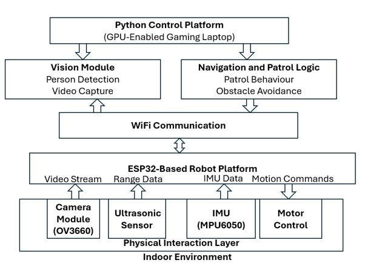
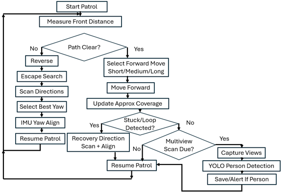
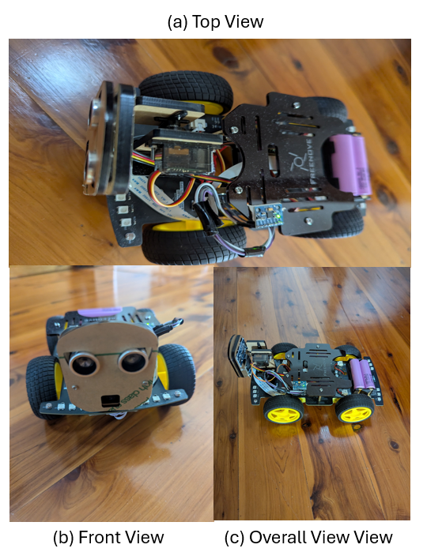

# low-cost-embodied-ai-surveillance-robot

Low-cost embodied AI robot for autonomous indoor surveillance using ESP32, IMU-based navigation, and YOLO person detection.

## Overview

This project demonstrates a low-cost embodied AI robot for indoor surveillance, autonomous patrol, obstacle recovery, multiview scanning, and real-time person detection. The platform combines an ESP32-based mobile robot, onboard sensing, wireless video streaming, and Python-based computer vision processing to investigate practical embodied AI concepts using affordable hardware.

## System Architecture



## Patrol Workflow



## Key Features

* ESP32-based robot control
* OV3660 camera streaming
* Ultrasonic obstacle sensing
* Retrofitted MPU6050 IMU for yaw-based heading alignment
* Python-based patrol controller
* YOLO-based person detection
* Multiview camera scanning
* Autonomous obstacle recovery

## Hardware Platform



## Attribution

This project is based on the Freenove 4WD Smart Car Kit (FNK0053). Several ESP32 firmware components are derived from or based on software supplied with the Freenove platform and remain subject to the original Freenove licence terms.

Additional modifications developed as part of this project include:

* MPU6050 IMU integration
* Yaw estimation and heading alignment
* Autonomous patrol behaviour
* Multiview environmental scanning
* External Python control platform
* Computer vision-based person detection
* Patrol coverage estimation and recovery strategies

## Licensing

This repository contains a mixture of original and third-party software components.

* Freenove-derived firmware components remain subject to the original Freenove licence terms.
* Python-based patrol, navigation, and computer vision software was developed as part of this project.
* Users are responsible for complying with the licence terms of all third-party libraries and frameworks used by this project.

## Repository Status

This repository is provided for educational and research purposes. Users should review the licence terms associated with Freenove and other third-party components before redistribution or commercial use.
## Hardware Requirements

The following hardware was used in the development and testing of the system:

### Robot Platform

* Freenove 4WD Smart Car Kit (FNK0053)
* ESP32-WROVER camera controller
* OV3660 camera module
* Ultrasonic distance sensor
* Servo motor for sensor/camera scanning
* Four-wheel drive motor platform

### Additional Hardware

* MPU6050 Inertial Measurement Unit (IMU) (retrofitted)
* Rechargeable battery pack

### Processing Platform

* Windows or Linux PC
* WiFi connectivity
* NVIDIA GPU (recommended for YOLO-based person detection)

### Software Requirements

* Arduino IDE
* ESP32 board support package
* Python 3.10 or later
* OpenCV
* Ultralytics YOLO
* NumPy
* Requests
* Pillow

### Optional Future Enhancements

The current implementation uses an external GPU-enabled laptop for computer vision processing and navigation control. Future versions may be migrated to onboard computing platforms such as:

* Raspberry Pi 5
* NVIDIA Jetson Nano
* NVIDIA Jetson Orin Nano

to support fully autonomous operation without an external control computer.

## Hardware Setup

### 1. Assemble the Freenove Robot Platform

Assemble the Freenove 4WD Smart Car Kit (FNK0053) according to the manufacturer's instructions. Verify that the following components are functioning correctly:

* ESP32-WROVER controller
* OV3660 camera module
* Ultrasonic distance sensor
* Servo motor assembly
* Four-wheel drive motors
* Battery pack

Before proceeding, confirm that the ESP32 firmware can be uploaded successfully and that the camera stream is accessible over WiFi.

### 2. Retrofit the MPU6050 IMU

The original FNK0053 platform does not include an inertial measurement unit (IMU). To support heading estimation and directional alignment, an MPU6050 IMU was added to the robot.

The MPU6050 module was mounted on the upper chassis of the robot using double-sided adhesive tape. The module was positioned to maintain a stable orientation reference while avoiding interference with the camera assembly and other moving components.

### 3. Connect the MPU6050 to the FNK0053 Control Board

The MPU6050 communicates using the I²C interface. The module was connected to the available I²C pins exposed on the FNK0053 control board, which interfaces with the onboard ESP32 controller.

| MPU6050 | FNK0053 Control Board |
| ------- | --------------------- |
| VCC     | 3.3V                  |
| GND     | GND                   |
| SDA     | SDA                   |
| SCL     | SCL                   |

The exact pin locations may vary depending on the hardware revision of the control board. Users should refer to the Freenove documentation and board silkscreen markings when making the connections.

### 4. Verify IMU Operation

Upload the ESP32 firmware and verify that valid MPU6050 measurements are being received. Rotate the robot manually and confirm that the reported yaw angle changes accordingly.

The IMU is used to provide heading information for yaw-based alignment during patrol operations. This enables more consistent directional control than would be possible using open-loop motor timing alone.

### 5. Configure WiFi Connectivity

Update the WiFi configuration parameters in the ESP32 firmware to match the local wireless network.

After uploading the firmware:

* Power on the robot.
* Connect the robot to the WiFi network.
* Verify that the camera stream is accessible.
* Verify that movement commands can be issued from the Python control platform.

### 6. Prepare the Patrol Controller

Install the Python environment and required dependencies as described in the Installation and Usage section.

Once communication between the Python controller and the robot has been established, the system is ready for autonomous patrol, multiview scanning, and person detection experiments.

## Installation and Usage

### 1. Configure and Upload the ESP32 Firmware

1. Install the Arduino IDE and ESP32 board support package.
2. Open the firmware project located in the `ESP32_Firmware` directory.
3. Update the WiFi configuration parameters to match your local network.
4. Compile and upload the firmware to the ESP32-based robot.
5. Verify that the camera stream and control interface are accessible from your local network.

### 2. Create a Python Virtual Environment

Clone the repository and navigate to the Python controller directory:

```bash
cd Python_Controller
```

Create a virtual environment:

```bash
python -m venv venv
```

Activate the environment:

**Windows**

```bash
venv\Scripts\activate
```

**Linux/macOS**

```bash
source venv/bin/activate
```

Install the required dependencies:

```bash
pip install -r requirements.txt
```

### 3. Configure Robot Connectivity

Edit the Python patrol script and update the robot IP address if necessary to match your ESP32 configuration.

Verify that:

* The ESP32 camera stream is accessible.
* The robot responds to movement commands.
* The Python controller can communicate with the robot over WiFi.

### 4. Run the Patrol Controller

Start the patrol application:

```bash
python robot_patrol_multiview_scan_v4.py
```

The controller will:

* Connect to the ESP32 camera stream.
* Perform autonomous patrol operations.
* Monitor obstacle distances.
* Execute multiview scanning.
* Run YOLO-based person detection.
* Save detection events when a person is observed.
* 
### Patrol Control Commands

The patrol controller supports interactive keyboard control during operation.

| Key   | Function                    |
| ----- | --------------------------- |
| **p** | Pause patrol operation      |
| **r** | Resume patrol operation     |
| **q** | Safely terminate the patrol |

The controller checks for keyboard commands at safe execution points during the patrol loop. When paused, all robot motion is stopped until a resume or quit command is received.

In addition to manual pausing, the software can be configured to pause automatically after image capture events by enabling the `AUTO_PAUSE_AFTER_SCAN_AND_DETECT` configuration parameter. This capability is useful when collecting training data, inspecting captured images, or debugging navigation behaviour.

These controls allow the user to safely monitor, interrupt, and resume autonomous patrol operations without restarting the software.

### 5. Stopping the Patrol

Press the designated keyboard interrupt key (or terminate the application) to stop the patrol operation safely.

